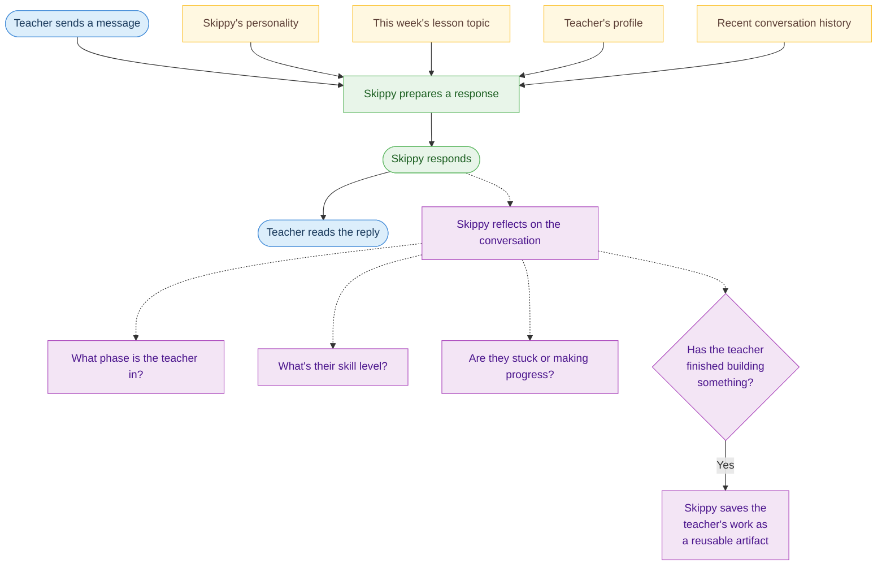

# How Skippy Works

This diagram shows the five main things that happen during a Skippy conversation. The teacher chats naturally in a window; behind the scenes, Skippy combines several sources of knowledge to give a personalized reply, then quietly reflects on the conversation to stay helpful over time.

**Legend**

| Color | Meaning |
|-------|---------|
| Blue | Teacher actions |
| Green | Skippy's main response |
| Yellow | Knowledge Skippy draws on |
| Purple | Skippy's quiet reflection (happens in the background) |
