# Skippy System Architecture

## Overview

Skippy is an AI tutoring system that guides teachers through a structured learning progression using layered prompt composition, an async classifier, and automatic artifact extraction. The design prioritizes zero-latency responses by running the expensive classifier asynchronously after each reply.

## Architecture Diagram

```mermaid
flowchart TD
    %% ── Client Layer ──────────────────────────────────────────
    subgraph CLIENT["Client — SkippyChat Component"]
        UI["SkippyChat (React)"]
    end

    UI -- "POST /api/skippy\n{ event, week, message }" --> ROUTE

    %% ── API Route ─────────────────────────────────────────────
    subgraph API["API Route — app/api/skippy/route.ts"]
        ROUTE{{"Event Dispatcher"}}
        ROUTE -- start_week --> SW["handleStartWeek"]
        ROUTE -- user_message --> UM["handleUserMessage"]
        ROUTE -- end_week --> EW["handleEndWeek"]
        ROUTE -- reset_week --> RW["handleResetWeek"]
    end

    %% ── Start Week Flow ───────────────────────────────────────
    SW -- "parallel fetch" --> CTX["getSkippyContext\n+ getOrCreateLedger"]
    CTX --> PROMPT_ASM

    %% ── System Prompt Assembly ────────────────────────────────
    subgraph PROMPT_ASM["System Prompt Assembly — lib/skippy.ts"]
        direction TB
        L1["Layer 1: SKIPPY_SYSTEM_PROMPT\n(global persona, conversation arc,\ncompletion rules)"]
        L2["Layer 2: WEEK_N_SYSTEM_PROMPT\n(week-specific pedagogy)"]
        L3["Layer 3: WEEK_N_OPENING_MESSAGE\n(interpolated with profile data)"]
        L4["Layer 4: profileContext\n(teacher profile summary)"]
        L5["Layer 5: formatLedgerForPrompt()\nphase · level behaviors · phase guidance\n4C status · misconceptions · artifact state\nspecific guidance · worked-example dialogue"]
        L6["Layer 6: Diagnostic probe\n(on session start, if not yet assessed)"]
        L1 --> L2 --> L3 --> L4 --> L5 --> L6
    end

    PROMPT_ASM --> SW_RESP["Return history,\nsystemPrompt, ledger"]
    SW_RESP --> UI

    %% ── User Message Flow ─────────────────────────────────────
    UM -- "parallel" --> SAVE_USER["Save user message\nto SkippyMessage"]
    UM -- "parallel" --> CTX2["getSkippyContext\n+ getLedger"]
    CTX2 --> PROMPT_ASM2["Assemble system prompt\n(same 6-layer composition)"]
    PROMPT_ASM2 --> HIST["Get conversation history\n(last 10 messages)"]

    %% ── Main LLM Call ─────────────────────────────────────────
    HIST --> LLM[["Claude Sonnet 4\nmax_tokens: 1500\ntemperature: 0.7"]]
    LLM --> SAVE_ASST["Save assistant message\nto SkippyMessage"]
    SAVE_ASST --> RESPOND["Return response\nto client"]
    RESPOND --> UI

    %% ── Async Classifier (fire-and-forget) ────────────────────
    SAVE_ASST -. "async\n(fire-and-forget)" .-> CLASSIFIER

    subgraph CLASSIFIER["Post-Response Classifier — lib/ledger.ts"]
        direction TB
        CL_PROMPT["Build classifier prompt\n(conversation history +\nSOLO progression descriptors)"]
        CL_LLM[["Claude Sonnet 4\nmax_tokens: 2500"]]
        CL_PARSE["Parse JSON response:\nphase · level · evidence\nartifact state · 4C booleans\nguidance · redirectCount"]
        CL_UPDATE["Update ConversationLedger\n• 4C booleans are sticky (never unset)\n• artifact state never overwritten with null\n• exchange count incremented"]
        CL_PROMPT --> CL_LLM --> CL_PARSE --> CL_UPDATE
    end

    %% ── Artifact Extraction (conditional) ─────────────────────
    CL_UPDATE -- "on SAVE transition\nor 4C completion" --> ARTIFACT

    subgraph ARTIFACT["Artifact Extraction — lib/artifacts.ts"]
        direction TB
        ART_FETCH["Fetch full conversation\nfrom SkippyMessage"]
        ART_REGEX["Strategy 1: Regex extraction\n(CONTEXT/COMMAND markers)"]
        ART_LLM[["Strategy 2: Claude Haiku\n(LLM fallback)"]]
        ART_META[["Generate metadata\n(title, description, tags)\nClaude Haiku"]]
        ART_FETCH --> ART_REGEX
        ART_REGEX -- "no match" --> ART_LLM
        ART_REGEX -- "match found" --> ART_META
        ART_LLM --> ART_META
    end

    %% ── End Week Flow ─────────────────────────────────────────
    EW --> EW_CHECK{"Artifact\nexists?"}
    EW_CHECK -- "no (exchanges > 2)" --> ARTIFACT
    EW_CHECK -- "yes" --> COMPLETE["Mark week completed\nin Progress"]

    %% ── Data Stores ───────────────────────────────────────────
    subgraph DB["PostgreSQL via Prisma"]
        DB_PROFILE[("UserProfile")]
        DB_MSG[("SkippyMessage")]
        DB_LEDGER[("ConversationLedger")]
        DB_ARTIFACT[("Artifact")]
        DB_PROGRESS[("Progress")]
    end

    SAVE_USER --> DB_MSG
    SAVE_ASST --> DB_MSG
    CL_UPDATE --> DB_LEDGER
    ART_META --> DB_ARTIFACT
    COMPLETE --> DB_PROGRESS
    CTX -- reads --> DB_PROFILE
    CTX -- reads --> DB_LEDGER
    CTX2 -- reads --> DB_PROFILE
    CTX2 -- reads --> DB_LEDGER
    HIST -- reads --> DB_MSG
    ART_FETCH -- reads --> DB_MSG
```

## Key Architectural Decisions

| Decision | Rationale |
|----------|-----------|
| **Async classifier** | The classifier runs fire-and-forget after the response is sent, adding zero latency to the user experience. Ledger updates are available by the next exchange. |
| **Layered prompt composition** | Six composable layers allow the system prompt to adapt per-week, per-phase, and per-teacher without combinatorial explosion. |
| **Sticky 4C booleans** | Once a 4C component (Context, Constraints, Command, Criteria) is marked complete, it is never unset — preventing regression from classifier noise. |
| **Two-model artifact strategy** | Regex extraction is tried first (fast, deterministic); Claude Haiku is the fallback (flexible, handles edge cases). Metadata is always generated by Haiku. |
| **10-message history window** | Limits context size while preserving enough conversational continuity for coherent tutoring. |
| **Conversation-sourced artifacts** | Artifacts are extracted from actual `SkippyMessage` records, not from the classifier's summary, avoiding hallucinated content. |

## Key Files

| File | Purpose |
|------|---------|
| `app/components/skippy-chat.tsx` | Client UI, event dispatch |
| `app/api/skippy/route.ts` | API endpoint, handler orchestration |
| `lib/skippy.ts` | System prompt assembly, context building |
| `lib/ledger.ts` | Ledger CRUD, classifier orchestration |
| `lib/artifacts.ts` | Artifact extraction, metadata generation |
| `lib/progressions.ts` | SOLO levels, diagnostic probes, week progressions |
| `prisma/schema.prisma` | Data models |
